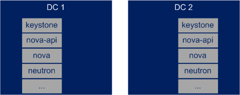

.. This work is licensed under a Creative Commons Attribution 4.0 International License.
.. http://creativecommons.org/licenses/by/4.0

Connection between different OpenStack regions or cloud instances
-----------------------------------------------------------------

Description
~~~~~~~~~~~
There should be an API to manage the infrastructure networks between two
OpenStack regions or instances.

The following figure (:numref:`instances-architecture`) shows the architecture
of the most relevant OpenStack components in multi instance OpenStack
environment.

The functionality behind the API depends on the underlying network providers (SDN
controllers) and the networking setup.
(For example both OpenDaylight and ONOS have an API to add new BGP neighbors.)

OpenStack Neutron should provide an abstracted API for this functionality what
calls the underlying SDN controllers API.

Derived Requirements
~~~~~~~~~~~~~~~~~~~~~
- Possibility to define a remote and a local endpoint
- As in case of cells the nova-api service is shared. It should be possible
  to identify the cell in the API calls

Northbound API / Workflow
+++++++++++++++++++++++++
- An infrastructure network management API is needed
- API call to define the remote and local infrastructure endpoints
- When the endpoints are created Neutron is configured to use the new network.

Data model objects
++++++++++++++++++
- local and remote endpoint objects (Most probably IP addresses with some
  additional properties, like local or remote Autonomus Systems (AS)).

Current implementation
~~~~~~~~~~~~~~~~~~~~~~
  Current OpenStack implementation provides no way to set up the underlay
  network connection.
  OpenStack Tricircle project [TRICIRCLE]_
  has plans to build up inter datacenter L2 and L3 networks.

Gaps in the current solution
~~~~~~~~~~~~~~~~~~~~~~~~~~~~
  An infrastructure management API is missing from Neutron where the local and
  remote endpoints of the underlay network could be configured.
