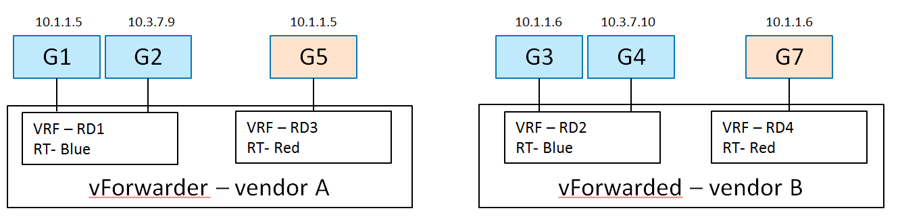

.. This work is licensed under a Creative Commons Attribution 4.0 International License.
.. http://creativecommons.org/licenses/by/4.0
.. (c) Bin Hu

L3VPNs are virtual layer 3 networks described in multiple standards and RFCs,
such as [RFC4364]_ and [RFC7432]_. Connectivity as well as traffic separation is
achieved by exchanging routes between VRFs (Virtual Routing and Forwarding).

Moreover, a Service Providers' virtualized network infrastructure may consist of
one or more SDN Controllers from different vendors. Those SDN Controllers may be
managed within one cloud or multiple clouds. Jointly, those VIMs (e.g. OpenStack
instances) and SDN Controllers work together in an interoperable framework to
create L3 services in the Service Providers' virtualized network infrastructure.

While interoperability between SDN controllers and the corresponding data planes
is ensured based on standardized protocols (e.g., [RFC4364]_ and [RFC7432]_),
the integration and management of different SDN domains from the VIM is not
clearly defined. Hence, this section analyses three L3VPN use cases involving
multiple SDN Controllers.

Any-to-Any Base Case
--------------------

Description
~~~~~~~~~~~

This any-to-any use case is the base scenario, providing layer 3 connectivity
between VNFs in the same L3VPN while separating the traffic and IP address
spaces of different L3VPNs belonging to different tenants.

There are 2 hosts (compute nodes). SDN Controller A and vForwarder A are
provided by Vendor A and run on host A. SDN Controller B and vForwarder B
are provided by Vendor B, and run on host B.

There are 2 tenants. Tenant 1 creates L3VPN Blue with 2 subnets: 10.1.1.0/24 and
10.3.7.0/24.  Tenant 2 creates L3VPN Red with 1 subnet and an overlapping
address space: 10.1.1.0/24. The network topology is shown in
:numref:`l3vpn-any2any-figure`.

In L3VPN Blue, VMs G1 (10.1.1.5) and G2 (10.3.7.9) are spawned on host A, and
attached to 2 subnets (10.1.1.0/24 and 10.3.7.0/24) and assigned IP addresses
respectively. VMs G3 (10.1.1.6) and G4 (10.3.7.10) are spawned on host B, and
attached to 2 subnets (10.1.1.0/24 and 10.3.7.0/24) and assigned IP addresses
respectively.

In L3VPN Red, VM G5 (10.1.1.5) is spawned on host A, and attached to subnet
10.1.1.0/24. VM G6 (10.1.1.6) is spawned on host B, and attached to the same
subnet 10.1.1.0/24.

Derived Requirements
~~~~~~~~~~~~~~~~~~~~~

Northbound API / Workflow
+++++++++++++++++++++++++

.. **Georg: this section needs to be made more readable**

An example of the desired workflow is as follows:

1. Create Network

2. Create Network VRF Policy Resource ``Any-to-Any``

  2.1. This policy causes the following configuration when a VM of this tenant is spawned on a host:

    2.1.1. There will be a RD assigned per VRF

    2.1.2. There will be a RT used for the common any-to-any communication

3. Create Subnet

4. Create Port (subnet, network VRF policy resource). This causes the controller to:

  4.1. Create a VRF in vForwarder's FIB, or update VRF if it already exists

  4.2. Install an entry for the guest's host route in FIBs of the vForwarder serving this tenant's virtual network

  4.3. Announce guest host route to WAN-GW via MP-BGP

Current implementation
~~~~~~~~~~~~~~~~~~~~~~

Support for creating and managing L3VPNs is available in OpenStack Neutron by
means of the [BGPVPN]_ project. In order to create the L3VPN network
configuration described above using the API [BGPVPN]_ API, the following workflow
is needed:

1. Create Neutron networks for tenant "Blue"

  ``neutron net-create --tenant-id Blue net1``

  ``neutron net-create --tenant-id Blue net2``

2. Create subnets for the Neutron networks for tenant "Blue"

  ``neutron subnet-create --tenant-id Blue --name subnet1 net1 10.1.1.0/24``

  ``neutron subnet-create --tenant-id Blue --name subnet2 net2 10.3.7.0/24``

3. Create Neutron ports in the corresponding networks for tenant "Blue"

   ``neutron port-create --tenant-id Blue --name G1 --fixed-ip subnet_id=subnet1,ip_address=10.1.1.5 net1``

   ``neutron port-create --tenant-id Blue --name G2 --fixed-ip subnet_id=subnet1,ip_address=10.1.1.6 net1``

   ``neutron port-create --tenant-id Blue --name G3 --fixed-ip subnet_id=subnet2,ip_address=10.3.7.9 net2``

   ``neutron port-create --tenant-id Blue --name G4 --fixed-ip subnet_id=subnet2,ip_address=10.3.7.10 net2``

4. Create Neutron network for tenant "Red"

  ``neutron net-create --tenant-id Red net3``

5. Create subnet for the Neutron network of tenant "Red"

  ``neutron subnet-create --tenant-id Red --name subnet3 net3 10.1.1.0/24``

6. Create Neutron ports in the networks of tenant "Red"

  ``neutron port-create --tenant-id Red --name G5 --fixed-ip subnet_id=subnet3,ip_address=10.1.1.5 net3``

  ``neutron port-create --tenant-id Red --name G7 --fixed-ip subnet_id=subnet3,ip_address=10.1.1.6 net3``

7. Create a L3VPN by means of the BGPVPN API for tenant "Blue"

  ``neutron bgpvpn-create --tenant-id Blue --route-targets AS:100 --name vpn1``

8. Associate the L3VPN of tenant "Blue" with the previously created networks

  ``neutron bgpvpn-net-assoc-create --tenant-id Blue --network net1 --name vpn1``

  ``neutron bgpvpn-net-assoc-create --tenant-id Blue --network net2 --name vpn1``

9. Create a L3VPN by means of the BGPVPN API for tenant "Red"

  ``neutron bgpvpn-create --tenant-id Red --route-targets AS:200 --name vpn2``

10. Associate the L3VPN of tenant "Red" with the previously created networks

  ``neutron bgpvpn-net-assoc-create --tenant-id Red --network net3 --name vpn2``

Comments:

* In this configuration only one BGPVPN for each tenant is created.

* The ports are associated indirectly to the VPN through their networks.

* The BGPVPN backend takes care of distributing the /32 routes to the vForwarder
  instances and assigning appropriate RD values.

Gaps in the current solution
~~~~~~~~~~~~~~~~~~~~~~~~~~~~

In terms of the functionality provided by the BGPVPN project, there are no gaps
preventing this particular use case from a L3VPN perspective.

However, in order to support the multi-vendor aspects of this use case, a better
support for integrating multiple backends is needed (see previous use case).

