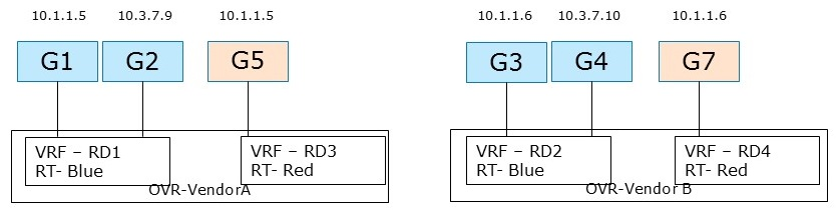

.. This work is licensed under a Creative Commons Attribution 4.0 International License.
.. http://creativecommons.org/licenses/by/4.0
.. (c) Bin Hu

Service Providers' virtualized network infrastructure may consist of one or more
SDN Controllers from different vendors. Those SDN Controllers may be managed
within one cloud or multiple clouds. Jointly, those VIMs (e.g. OpenStack instances)
and SDN Controllers work together in an interoperable framework to create L3 services
in Service Providers' virtualized network infrastructure.

Three use cases of creating L3VPN service by multiple SDN Controllers are described
as follows.

Any-to-Any Base Case
--------------------

Description
~~~~~~~~~~~

There are 2 hosts (compute nodes). SDN Controller A and vRouter A are provided by
Vendor A, and run on host A. SDN Controller B and vRouter B are provided by
Vendor B, and run on host B.

There are 2 tenants. Tenant 1 creates L3VPN Blue with 2 subnets: 10.1.1.0/24 and 10.3.7.0/24.
Tenant 2 creates L3VPN Red with 1 subnet, overlapping address space: 10.1.1.0/24.

The network topology is shown in :numref:`l3vpn-any2any-figure`:

In L3VPN Blue, VMs G1 (10.1.1.5) and G2 (10.3.7.9) are spawned on host A, and attached to 2 subnets
(10.1.1.0/24 and 10.3.7.0/24) and assigned IP addresses respectively. VMs G3 (10.1.1.6) and
G4 (10.3.7.10) are spawned on host B, and attached to 2 subnets (10.1.1.0/24 and 10.3.7.0/24)
and assigned IP addresses respectively.

In L3VPN Red, VM G5 (10.1.1.5) is spawned on host A, and attached to subnet 10.1.1.0/24. VM G6
(10.1.1.6) is spawned on host B, and attached to the same subnet 10.1.1.0/24.

VRF Lets us do:

1. Overlapping Addresses

2. Segregation of Traffic

Derrived Requirements
~~~~~~~~~~~~~~~~~~~~~

Northbound API / Workflow
+++++++++++++++++++++++++

Exemplary workflow is described as follows:

1. Create Network

2. Create Network VRF Policy Resource ``Any-to-Any``

  2.1. This sets up that when this tenant is put on a HOST that:

    2.1.1. There will be a RD assigned per VRF

    2.1.2. There will be a RT used for the common any-to-any communication

3. Create Subnet

4. Create Port (subnet, network vrf policy resource). This causes controller to:

  4.1. Create vrf in vRouter's FIB, or Update vrf if already exists

  4.2. Install an entry for Guest's HOST-Route in FIBs of Vrouters serving this tenant Virtual Network

  4.3. Announce Guest HOST-Route to WAN-GW via MP-BGP

Data model objects
++++++++++++++++++
   - TBD

Orchestration
+++++++++++++
   - TBD

Dependencies on compute services
++++++++++++++++++++++++++++++++
   - TBD

Current implementation
~~~~~~~~~~~~~~~~~~~~~~

Support for creating and managing L3VPNs is available in OpenStack Neutron by
means of the BGPVPN project [BGPVPN]_. In order to create the L3VPN network
configuration described above using the API BGPVPN API, the following workflow
is needed:

1. Create a Neutron network "blue"

  :code:`neutron net-create blue`

2. Create the first Neutron subnet of the network "blue"

  :code:`neutron subnet-create <blue network UUID> 10.1.1.0/24`

3. Create the second Neutron subnet of the network "blue"

  :code:`neutron subnet-create <blue network UUID> 10.3.7.0/24`

4. Create a L3VPN by means of the BGPVPN API

  :code:`neutron bgpvpn-create --route-targets 64512:1 --tenant-id <tenant-id> --name blue`

5. Associate the L3VPN with the previously created network

  :code:`neutron bgpvpn-net-assoc-create blue --network <network-UUID>`

  This command associates the given Neutron network with the L3VPN. The semantic
  of this operation is that all subnets bound to the network are getting
  interconnected through the BGP VPN and hence VMs located in either subnet can
  communicate with each other.

Gaps in the current solution
~~~~~~~~~~~~~~~~~~~~~~~~~~~~

TBD

Conclusion
~~~~~~~~~~

TBD

