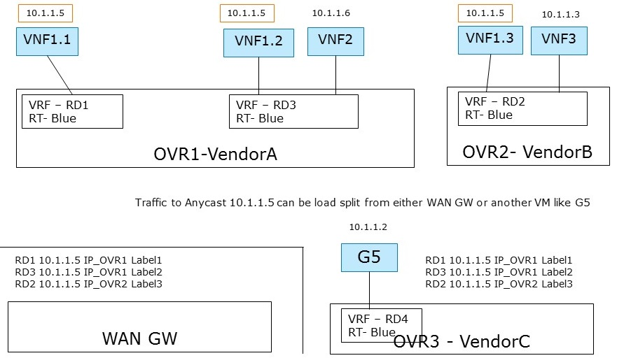

.. This work is licensed under a Creative Commons Attribution 4.0 International License.
.. http://creativecommons.org/licenses/by/4.0
.. (c) Bin Hu

L3VPN: ECMP Load Splitting Case (Anycast)
-----------------------------------------

Description
~~~~~~~~~~~

In this use case, multiple instances of a VNF are reachable through the same IP.
The networking infrastructure is then responsible for spreading the network load
across the VNF instances using Equal-Cost Multi-Path (ECMP) or perform a
fail-over in case of a VNF failure.

There are 2 hosts (compute nodes). SDN Controller A and vForwarder A are provided by
Vendor A, and run on host A. SDN Controller B and vForwarder B are provided by
Vendor B, and run on host B.

There is one tenant. Tenant 1 creates L3VPN Blue with subnet 10.1.1.0/24.

The network topology is shown in :numref:`l3vpn-ecmp-figure`:

In L3VPN Blue, VNF1.1 and VNF1.2 are spawned on host A, attached to subnet 10.1.1.0/24
and assigned the same IP address 10.1.1.5. VNF1.3 is spawned on host B, attached to
subnet 10.1.1.0/24 and assigned the same IP addresses 10.1.1.5. VNF 2 and VNF 3 are spawned
on host A and B respectively, attached to subnet 10.1.1.0/24, and assigned different IP
addresses 10.1.1.6 and 10.1.1.3 respectively.

Here, the Network VRF Policy Resource is ``ECMP/AnyCast``. Traffic to **Anycast 10.1.1.5**
can be load split from either WAN GW or another VM like G5.

Current implementation
~~~~~~~~~~~~~~~~~~~~~~

Support for creating and managing L3VPNs is in general available in OpenStack
Neutron by means of the BGPVPN project [BGPVPN]_. However, the BGPVPN project
does not yet fully support ECMP as described in the following.

There are (at least) two different approached to configuring ECMP:

1. Using Neutron ports with identical IP addresses, or

2. Using Neutron ports with unique IPs addresses and creating static routes to a
   common IP prefix with next hops pointing to the unique IP addresses.

Ports with identical IP addresses
+++++++++++++++++++++++++++++++++

In this approach, multiple Neutron ports using the same IP address are created.
In the current Neutron architecture, a port has to reside in a specific Neutron
network. However, re-using the same IP address multiple times in a given Neutron
network is not possible as this would create an IP collision. As a consequence,
creating one Neutron network for each port is required.

Given multiple Neutron networks, the BGPVPN API allows for associating those
networks with the same VPN. It is then up to the networking backend to implement
ECMP load balancing. This behavior and the corresponding API for configuring the
behavior is currently not available. It is nevertheless on the road map of the
BGPVPN project.

.. **Georg: we could add an API usage example here similarly to the one below**

Static Routes to ports with unique IP addresses
+++++++++++++++++++++++++++++++++++++++++++++++

In this approach, Neutron ports are assigned unique IPs and static routes
pointing to the same ECMP load-balanced prefix are created. The static routes
define the unique Neutron port IPs as next-hop addresses.

Currently, the API for static routes is not yet available in the BGPVPN project,
but it is on the road map. The following work flow shows how to realize this
particular use case under the assumption that support for static routes is
available in the BGPVPN API.

1. Create Neutron network for tenant "Blue"

  ``neutron net-create --tenant-id Blue net1``

2. Create subnet for the network of tenant "Blue"

  ``neutron subnet-create --tenant-id Blue --name subnet1 net1 5.1.1.0/24``

3. Create Neutron ports in the network of tenant "Blue"

  ``neutron port-create --tenant-id Blue --name G1 --fixed-ip subnet_id=subnet1,ip_address=5.1.1.1 net1``

  ``neutron port-create --tenant-id Blue --name G2 --fixed-ip subnet_id=subnet1,ip_address=5.1.1.2 net1``

  ``neutron port-create --tenant-id Blue --name G3 --fixed-ip subnet_id=subnet1,ip_address=5.1.1.3 net1``

  ``neutron port-create --tenant-id Blue --name G4 --fixed-ip subnet_id=subnet1,ip_address=5.1.1.4 net1``

  ``neutron port-create --tenant-id Blue --name G5 --fixed-ip subnet_id=subnet1,ip_address=5.1.1.5 net1``

  ``neutron port-create --tenant-id Blue --name G6 --fixed-ip subnet_id=subnet1,ip_address=5.1.1.6 net1``

4. Create a L3VPN for tenant "Blue"

  ``neutron bgpvpn-create --tenant-id Blue --route-target AS:100 vpn1``

5. Associate the BGPVPN with the network of tenant "Blue"

  ``neutron bgpvpn-network-associate --tenant-id Blue --network-id net1 vpn1``

6. Create static routes which point to the same target

  ``neutron bgpvpn-static-route-add --tenant-id Blue --cidr 10.1.1.5/32 --nexthop-ip 5.1.1.1 vpn1``

  ``neutron bgpvpn-static-route-add --tenant-id Blue --cidr 10.1.1.5/32 --nexthop-ip 5.1.1.2 vpn1``

  ``neutron bgpvpn-static-route-add --tenant-id Blue --cidr 10.1.1.5/32 --nexthop-ip 5.1.1.3 vpn1``

Gaps in the current solution
~~~~~~~~~~~~~~~~~~~~~~~~~~~~

Given the use case description and the currently available implementation in
OpenStack provided by BGPVPN project, we identify the following gaps:

* [L3VPN-ECMP-GAP1] Static routes are not yet supported by the BGPVPN project.

  Currently, no API for configuring static routes is available in the BGPVPN
  project. This feature is on the road map, however.

* [L3VPN-ECMP-GAP2] Behavior not defined for multiple Neutron ports of the same
  IP

  The Neutron and BGPVPN API allow for creating multiple ports with the same
  IP in different networks and associating the networks with the same VPN. The
  exact behavior of this configuration is however not defined and an API for
  configuring the behavior (load-balancing or fail-over) is missing. Development
  of this feature is on the road map of the project, however.

* [L3VPN-ECMP-GAP3] It is not possible to assign the same IP to multiple Neutron
  ports within the same Neutron subnet.

  This is due to the fundamental requirement of avoiding IP collisions within
  the L2 domain which is a Neutron network.

Conclusions
~~~~~~~~~~~

In the context of the ECMP use case, three gaps have been
identified. Gap [L3VPN-ECMP-GAP1] and [L3VPN-ECMP-GAP2] are missing or undefined
functionality in the BGPVPN project. There is no architectural hindrance
preventing the implementation of the missing features in the BGPVPN project as
well as in Neutron.

The third gap [L3VPN-ECMP-GAP3] is based on the fact that Neutron ports always
have to exist in a Neutron network. As a consequence, in order to create ports
with the same IP, multiple networks must be used. This port-network binding
will most likely not be relaxed in future releases of Neutron to retain backwards
compatibility. A clean alternative to Neutron can instead provide more modeling
flexibility.
