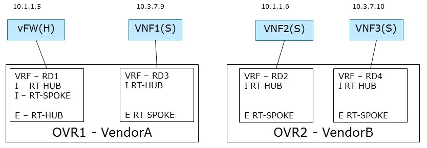

.. This work is licensed under a Creative Commons Attribution 4.0 International License.
.. http://creativecommons.org/licenses/by/4.0
.. (c) Bin Hu

Hub and Spoke Case
------------------

Description
~~~~~~~~~~~

A Hub-and-spoke topology comprises two types of network entities: a central hub
and multiple spokes. The corresponding VRFs of the hub and the spokes are
configured to import and export routes such that all traffic is routed through
the hub. As a result, spokes cannot communicate with each other directly, but
only indirectly via the central hub. Hence, the hub typically hosts central network
functions such firewalls.

Furthermore, there is no layer 2 connectivity between the VNFs.

In addition, in this use case, the deployed network infrastructure comprises
equipment from two different vendors, Vendor A and Vendor B. There are 2 hosts
(compute nodes). SDN Controller A and vRouter A are provided by Vendor A, and
run on host A. SDN Controller B and vRouter B are provided by Vendor B, and run
on host B.

There is 1 tenant. Tenant 1 creates L3VPN Blue with 2 subnets: 10.1.1.0/24 and 10.3.7.0/24.

The network topology is shown in :numref:`l3vpn-hub-spoke-figure`:

In L3VPN Blue, vFW(H) is acting the role of ``hub`` (a virtual firewall).
The other 3 VNF VMs are ``spoke``. vFW(H) and VNF1(S) are spawned on host A,
and VNF2(S) and VNF3(S) are spawned on host B. vFW(H) (10.1.1.5) and VNF2(S)
(10.1.1.6) are attached to subnet 10.1.1.0/24. VNF1(S) (10.3.7.9) and VNF3(S)
(10.3.7.10) are attached to subnet 10.3.7.0/24.

Derived Requirements
~~~~~~~~~~~~~~~~~~~~~

Northbound API / Workflow
+++++++++++++++++++++++++

[**Georg: this needs to be made more readable / explanatory**]

Exemplary vFW(H) Hub VRF is as follows:

* RD1 10.1.1.5  IP_OVR1 Label1
* RD1 0/0 IP_OVR1 Label1
* Label 1 Local IF (10.1.1.5)
* RD3 10.3.7.9  IP_OVR1 Label2
* RD2 10.1.1.6  IP_OVR2 Label3
* RD4 10.3.7.10 IP_OVR2 Label3

Exemplary VNF1(S) Spoke VRF is as follows:

* RD1 0/0 IP_OVR1 Label1
* RD3 10.3.7.9  IP_OVR1 Label2

Exemplary workflow is described as follows:

1. Create Network

2. Create VRF Policy Resource

  2.1. Hub and Spoke

3. Create Subnet

4. Create Port

  4.1. Subnet

  4.2. VRF Policy Resource, [H | S]

Data model objects
++++++++++++++++++
   - TBD

Current implementation
++++++++++++++++++++++

Different APIs have been developed to support creating a L3 network topology and
directing network traffic through specific network elements in specific order,
for example, [BGPVPN]_ and [NETWORKING-SFC]_. We analyzed those APIs regarding
the Hub-and-Spoke use case.

BGPVPN
''''''

Support for creating and managing L3VPNs is in general available in OpenStack
Neutron by means of the BGPVPN API [BGPVPN]_. However, the [BGPVPN]_ API
does not support creating the Hub-and-Spoke topology as outlined above, i.e.
setting up specific VRFs of vFW(H) and other VNFs(S) within one L3VPN to direct
the traffic from vFW(H) to VNFs(S).
[**Georg: I'd like to move the last statement further down as this is already a
conclusion without having done any kind of analysis.**]

The [BGPVPN]_ API currently supports the concepts of network- and
router-associations. An association maps Neutron network objects (networks and
routers) to a VRF with the following semantics:

* A *network association* interconnects all subnets and ports of a Neutron
  network by binding them to a given VRF
* a *router association* interconnects all networks, and hence indirectly all
  ports, connected to a Neutron router by binding them to a given VRF

It is important to notice that these associations apply to entire Neutron
networks including all ports connected to a network. This is due to the fact
that in the Neutron, ports can only exist within a network but not individually.
Furthermore, Neutron networks were originally designed to represent layer 2
domains. As a result, ports within the same Neutron network typically have layer
connectivity among each other. There are efforts to relax this original design
assumption, e.g. routed networks, which however do not solve the problem at hand
here (see the gap analysis further down below).

In order to realize the hub-and-spoke topology outlined above, VRFs need to be
created on a per port basis. Specifically, ports belonging to the same network
should not be interconnected except through a corresponding configuration of a
per-port-VRF.  This configuration includes setting up next-hop routing table,
labels, I-RT and E-RT etc. in order to enable traffic direction from hub to
spokes.

It may be argued that given the current network- and router-association mechanisms,
the following workflow establishes a network topology which aims to achieve the desired
traffic flow from Hub to Spokes. The basic idea is to model separate VRFs per VM
by creating a dedicated Neutron network with two subnets for each VRF in the
Hub-and-Spoke topology.

1. Create Neutron network "hub"
  ``neutron net-create --tenant-id Blue hub``

2. Create a separate Neutron network for every "spoke"
  ``neutron net-create --tenant-id Blue spoke-i``

3. For every network (hub and spokes), create two subnets
  ``neutron subnet-create <hub/spoke-i UUID> --tenant-id Blue 10.1.1.0/24``

  ``neutron subnet-create <hub/spoke-i UUID> --tenant-id Blue 10.3.7.0/24``

4. Create the Neutron ports in the corresponding networks
  ``neutron port-create --tenant-id Blue --name vFW(H) --fixed-ip subnet_id=<hub UUID>,ip_address=10.1.1.5``

  ``neutron port-create --tenant-id Blue --name VNF1(S) --fixed-ip subnet_id=<spoke-i UUID>,ip_address=10.3.7.9``

  ``neutron port-create --tenant-id Blue --name VNF2(S) --fixed-ip subnet_id=<spoke-i UUID>,ip_address=10.1.1.6``

  ``neutron port-create --tenant-id Blue --name VNF3(S) --fixed-ip subnet_id=<spoke-i UUID>,ip_address=10.3.7.10``

5. Create a BGPVPN object (VRF) for the hub network with the corresponding import
   and export targets
  ``neutron bgpvpn-create --name hub-vrf --import-targets <RT-hub RT-spoke> --export-targets <RT-hub>``

6. Create a BGPVPN object (VRF) for every spoke network with the corresponding import
   and export targets
  ``neutron bgpvpn-create --name spoke-i-vrf --import-targets <RT-hub> --export-targets <RT-spoke>``

7. Associate the hub network with the hub VRF
  ``bgpvpn-net-assoc-create hub --network <hub network-UUID>``

8. Associate each spoke network with the corresponding spoke VRF
  ``bgpvpn-net-assoc-create spoke-i --network <spoke-i network-UUID>``

9. Add static route to direct all traffic to vFW VNF running at the hub.

   **Note:** Support for static routes not yet available.

  ``neutron bgpvpn-static-route-add --tenant-id Blue --cidr 0/0 --nexthop-ip 10.1.1.5 hub``

After step 9, VMs can be booted with the corresponding ports.

The resulting network topology intents to resemble the target topology as shown in
:numref:`l3vpn-hub-spoke-figure`, and achieve the desired traffic direction from Hub to Spoke.
However, it deviates significantly from the essence of the Hub-and-Spoke use case as
described above in terms of desired network topology, i.e. one L3VPN with multiple
VRFs associated with vFW(H) and other VNFs(S) separately. And this method of using
the current network- and router-association mechanism is not scalable when there are large
number of Spokes, and in case of scale-in and scale-out of Hub and Spokes.

The gap analysis in the next section describes the technical reasons for this.

Network SFC
'''''''''''

Support of Service Function Chaining is in general available in OpenStack Neutron through
the Neutron API for Service Insertion and Chaining project [NETWORKING-SFC]_.
However, the [NETWORKING-SFC]_ API is focused on creating service chaining through
NSH at L2, although it intends to be agnostic of backend implementation. It is unclear whether
or not the service chain from vFW(H) to VNFs(S) can be created in the way of L3VPN-based
VRF policy approach using [NETWORKING-SFC]_ API.

Hence, it is currently not possible to configure the networking use case as described above.
**Georg: we need to look deeper into SFC to substantiate our claim here.**

Gaps in the Current Solution
++++++++++++++++++++++++++++

Given the use case description and the currently available implementation in
OpenStack provided by [BGPVPN]_ project and [NETWORKING-SFC]_ project,
we identify the following gaps:

[L3VPN-HS-GAP1] No means to disable layer 2 semantic of Neutron networks
''''''''''''''''''''''''''''''''''''''''''''''''''''''''''''''''''''''''

Neutron networks were originally designed to represent layer 2 broadcast
domains. As such, all ports connected to a network are in principle
inter-connected on layer 2 (not considering security rules here). In contrast,
in order to realize L3VPN use cases such as the hub-and-spoke topology,
connectivity among ports must be controllable on a per port basis on layer 3.

There are ongoing efforts to relax this design assumption, for instance by means
of routed networks ([NEUTRON-ROUTED-NETWORKS]_). In a routed network, a Neutron network
is a layer 3 domain which is composed of multiple layer 2 segments. A routed
network only provides layer 3 connectivity across segments, but layer 2
connectivity across segments is **optional**. This means, depending on the
particular networking backend and segmentation technique used, there might be
layer 2 connectivity across segments or not. A new flag ``l2_adjacency``
indicates whether or not a user can expect layer 2 connectivity or not across
segments.

This flag, however, is ready-only and cannot be used to overwrite or disable the
layer 2 semantics of a Neutron network.

[L3VPN-HS-GAP2] No port-association available in the BGPVPN project yet
'''''''''''''''''''''''''''''''''''''''''''''''''''''''''''''''''''''''

Due to gap [L3VPN-HS-GAP1], the [BGPVPN]_ project was not yet able to implement
the concept of a port association. A port association would allow to associate
individual ports with VRFs and thereby control layer 3 connectivity on a per
port basis.

The workflow described above intents to mimic port associations by means of
separate Neutron networks. Hence, the resulting workflow is overly complicated
and not intuitive by requiring to create additional Neutron entities (networks)
which are not present in the target topology. Moreover, creating large numbers
of Neutron networks limits scalability.

Port associations are on the road map of the [BGPVPN]_ project, however, no
design that overcomes the problems outlined above has been specified yet.
Consequently, the time-line for this feature is unknown.

As a result, creating a clean Hub-and-Spoke topology is current not yet
supported by the [BGPVPN]_ API.

[L3VPN-HS-GAP3] No support for static routes in the BGPVPN project yet
''''''''''''''''''''''''''''''''''''''''''''''''''''''''''''''''''''''

In order to realize the hub-and-spoke use case, a static route is needed to
attract the traffic at the hub to the corresponding VNF (direct traffic to the
firewall). Support for static routes in the BGPVPN project is available for the
router association by means of the Neutron router extra routes feature. However,
there is no support for static routes for network and port associations yet.

Design work for supporting static routes for network associations has started,
but no final design has been proposed yet.

..
.. [L3VPN-HS-GAP4] Creating a clean hub-and-spoke topology is current not yet supported by the NETWORKING-SFC API.
.. [Georg: We need to look deeper into SFC before we can substantiate our claim]

